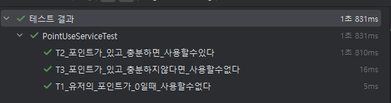

### 테이블 구조 되짚어보기

- PointHistory `포인트 충전/사용 내역`
    - ID (히스토리 테이블 식별자)
    - 유저 ID (포인트 충전한 유저 식별자)
    - 충전량 (충전 포인트 금액)
    - 트랜잭션 타입 (충전 : CHARGE, 사용 : USE)
    - 변경 시간 (Milli초)


- UserPoint `유저가 가진 포인트`
    - ID : 유저 ID
    - 포인트 : 현재 유저가 가지고 있는 포인트 금액
    - 변경 시간 (Milli초)

'

> #### 유저의 사용 꼭지점에 대해서 고민을 해보자면,
1. 포인트가 0원 일 때
   - 포인트 사용을 할 수 없다.


2. 포인트가 0원이 아닐 때
   - 포인트가 사용하려는 포인트가 많다면, 포인트를 쓴 다.
   - 포인트가 사용하려는 포인트보다 적다면, 포인트를 쓸 수 없다.
     - (포인트가 0원일 때랑 똑같음)

  '
> #### throttle(sleep 시간)에 따른, 추가 확장 가능성?
1. 같은 사용 요청이 동시에 두번 들어 온다면?
   - 같은 사용 요청인지 판별할 기준이 필요하고, 그 기준에 따라 한번만 수행되도록 보장할 필요가 있다.


2. 충전이 아직 완료 되지 않았는데, 사용 요청이 들어온다면??
   - 각 충전/사용 단계가 명확하게 구분되어 테이블에 값이 올바르게 반영되어야한다.


3. 또는, 충전 금액이 충분할 때, 서로 다른 사용 요청이 여러번 온다면 모든 기능이 동작 완료된 후, 올바른 사용 금액과 잔여금액이 Table에 반영되도록 한다.
---

### 테스트 시나리오 생각해보기
1. 그렇다면, 사용에 성공했을 때는 서비스에서 사용하고 남은 UserPoint를 응답해주면 되지만,


2. 실패했을 때는 어떤 값을 응답해주고, 로직을 이어나갈 수 있을지 고민해볼 수 있을 것 같다.
    - 실패했을 때는 어떻게 다음 로직을 처리할 수 있을까?

---

### 이전 조회/충전에서는 화이트박스를 하였으니, 이번에는 블랙박스로 작성해보기..

- 외부의 서비스인 경우
    - Fake 객체를 구현하기
- 내부의 서비스인 경우
  - 비즈니스 외적인 부수효과가 존재하는 경우: Dummy 객체를 사용하기
  - 데이터 확보가 어려운 경우: 모의 객체 프레임워크를 통해 Stub 사용하기
  - 그 외 대부분의 경우: 실제 객체를 사용하기

*** PointService의 내부동작은 모르고 테스트 코드 작성을 하되,
PointSErvice가 의존하는 외부 객체를 fake로 대체해주기.

*** 테스트 환경에서는 직접 의존 객체를 통제해줘야하는가?

---

### 0원 일때, 포인트 사용시 예외 처리해주기

#### RED
```
    @Test
    void T1_유저의_포인트가_0일때_사용할수없다(){
        //given
        Long userId = 1L;
        long useAmount = 10L;
        UserPoint currUserPoint = UserPoint.empty(userId);

        given(userPointTable.selectById(userId)).willReturn(currUserPoint);

        // when&then
        assertThatThrownBy(() ->
                pointService.use(userId, useAmount)
        ).isInstanceOf(IllegalStateException.class)
                .hasMessageContaining("잔여 포인트가 부족합니다");
    }
```

`error: cannot find symbol pointService.use(userId, useAmount)`

#### green
```
public UserPoint use(Long userId, long useAmount) {
        UserPoint curUserPoint = getPoint(userId);
        long newPoint = curUserPoint.point() - useAmount;

        if(curUserPoint.point() == 0 || newPoint < 0){
            throw new IllegalStateException("잔여 포인트가 부족합니다");
        }

        UserPoint updatedUserPoint = userPointTable.insertOrUpdate(userId, newPoint);
        PointHistory newPointHistory =pointHistoryTable.insert(userId, newPoint, TransactionType.USE, System.currentTimeMillis());

        return  updatedUserPoint;
    }
```

코드 작성 시, 예외처리를 통해 올바르지 않은 사용에 대한 분기 처리의 다음 단계를 고려해보기

